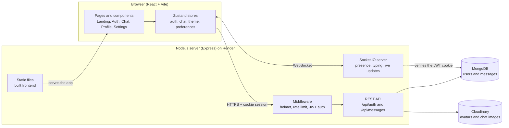
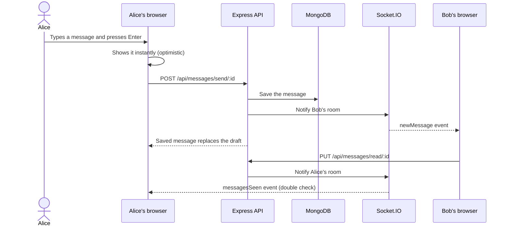
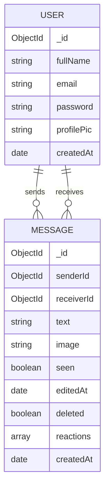

# OnlyChat

**A real-time chat app with live messaging, photo sharing, reactions and a polished, themeable UI.**

Full-stack MERN application: one-to-one conversations that update instantly, read receipts, typing indicators, message editing and deletion, and a landing page. It runs as a single service, where the Express server also serves the built React app.

**Live demo:** https://fullstack-chat-app-70i9.onrender.com

---

## 🚀 Features

**Messaging**
- Real-time delivery over Socket.IO, with no polling
- Read receipts, typing indicators and live online/offline presence
- Unread badges and last-message previews that persist across sessions
- Reactions, message editing (15 minutes) and delete for everyone
- Photo sharing through Cloudinary, compressed in the browser before upload
- Paginated history, so long conversations stay fast

**Account**
- Signup and login with JWT stored in an httpOnly cookie
- Profile with editable name and photo
- Change password and delete account from the settings page

**Experience**
- Landing page with an animated product showcase
- 10 switchable themes (daisyUI), responsive from phone to desktop
- Optimistic sending, image lightbox, emoji picker, paste-to-attach
- Message sound and desktop notifications (optional)
- Lazy-loaded pages and cached vendor bundles

**Security**
- Helmet security headers with a strict Content Security Policy
- Rate limiting on login, signup, messages and account actions
- Sockets authenticated with the same JWT cookie (the server never trusts a client-sent user id)
- Input validation on every endpoint and restricted image types

---

## 🧱 Tech Stack

| Layer | Technology |
|---|---|
| Frontend | React 18, Vite, Zustand, React Router, Tailwind CSS + daisyUI, Lucide icons |
| Backend | Node.js, Express, Socket.IO |
| Database | MongoDB (Mongoose) |
| Auth | JWT (httpOnly cookie) + bcrypt |
| Media | Cloudinary |
| Hosting | Render (single web service) |

---

## 🏗️ Architecture



### How a message travels



### Data model



---

## 📁 Project structure

```
chat-app/
├── backend/
│   └── src/
│       ├── controllers/     auth and message logic
│       ├── lib/             db, socket server, cloudinary, helpers
│       ├── middleware/      JWT auth, rate limiting
│       ├── models/          User, Message
│       ├── routes/          auth and message routes
│       └── index.js         server entry point
└── frontend/
    └── src/
        ├── components/
        │   ├── auth/        login and signup building blocks
        │   ├── chat/        sidebar, conversation, message input
        │   ├── landing/     landing page sections
        │   └── skeletons/   loading placeholders
        ├── pages/           one file per route
        ├── store/           Zustand stores
        ├── lib/             axios, validation, image and notification helpers
        └── constants/
```

---

## 🛠️ Getting started

**Requirements:** Node.js 18+, a MongoDB database and a Cloudinary account.

**1. Install**

```bash
cd backend && npm install
cd ../frontend && npm install
```

**2. Configure** `backend/.env` (one variable per line):

```env
PORT=5001
NODE_ENV=development
MONGODB_URI=your-mongodb-connection-string
JWT_SECRET=a-long-random-string
CLOUDINARY_CLOUD_NAME=your-cloud-name
CLOUDINARY_API_KEY=your-api-key
CLOUDINARY_API_SECRET=your-api-secret
CLIENT_URL=http://localhost:5173
```

**3. Run** (two terminals)

```bash
cd backend && npm run dev
cd frontend && npm run dev
```

Open http://localhost:5173.

---

## ☁️ Deployment (Render)

The whole app runs as one web service:

- **Build command:** `npm run build` (installs both folders and builds the frontend)
- **Start command:** `npm start`
- **Environment:** the variables above, with `NODE_ENV=production` and `CLIENT_URL` set to the public URL

In production the Express server serves the built frontend and the API from the same origin.

---

## 🔌 API overview

| Method | Endpoint | Description |
|---|---|---|
| POST | `/api/auth/signup` | Create an account |
| POST | `/api/auth/login` | Log in |
| POST | `/api/auth/logout` | Log out |
| GET | `/api/auth/check` | Current session (or `null`) |
| PUT | `/api/auth/update-profile` | Change name or photo |
| PUT | `/api/auth/change-password` | Change password |
| DELETE | `/api/auth/account` | Delete the account |
| GET | `/api/messages/users` | Conversations with last message and unread count |
| GET | `/api/messages/:id` | Paginated history with a user |
| POST | `/api/messages/send/:id` | Send a message |
| PUT | `/api/messages/read/:id` | Mark a conversation as read |
| PATCH | `/api/messages/item/:messageId` | Edit a message |
| DELETE | `/api/messages/item/:messageId` | Delete for everyone |
| PUT | `/api/messages/item/:messageId/reaction` | Add, change or remove a reaction |
| GET | `/api/health` | Health check |

**Socket events:** `getOnlineUsers`, `newMessage`, `messageUpdated`, `messagesSeen`, `typing`.

---

## 🗺️ Roadmap

- Group conversations
- Replies and in-conversation search
- Voice messages
- Session management (log out all devices)
- Automated tests

---

## 📄 License

**All rights reserved.** The source is visible for evaluation only. See the [LICENSE](LICENSE) file for the full terms.

© 2024-2026 Safwen Ben Mabrouk

---

## 📬 Contact

**Safwen Ben Mabrouk**, Full-Stack Software Engineer
- Email: safwenbenmabrouk@gmail.com
- LinkedIn: [linkedin.com/in/safwen-ben-mabrouk](https://linkedin.com/in/safwen-ben-mabrouk)
- GitHub: [@Safwen-bm](https://github.com/Safwen-bm)